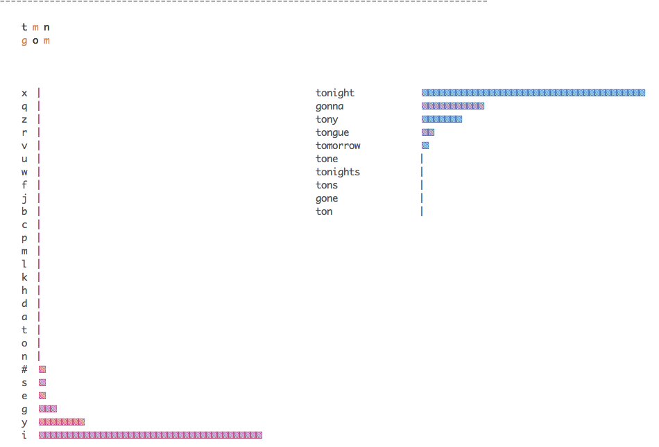
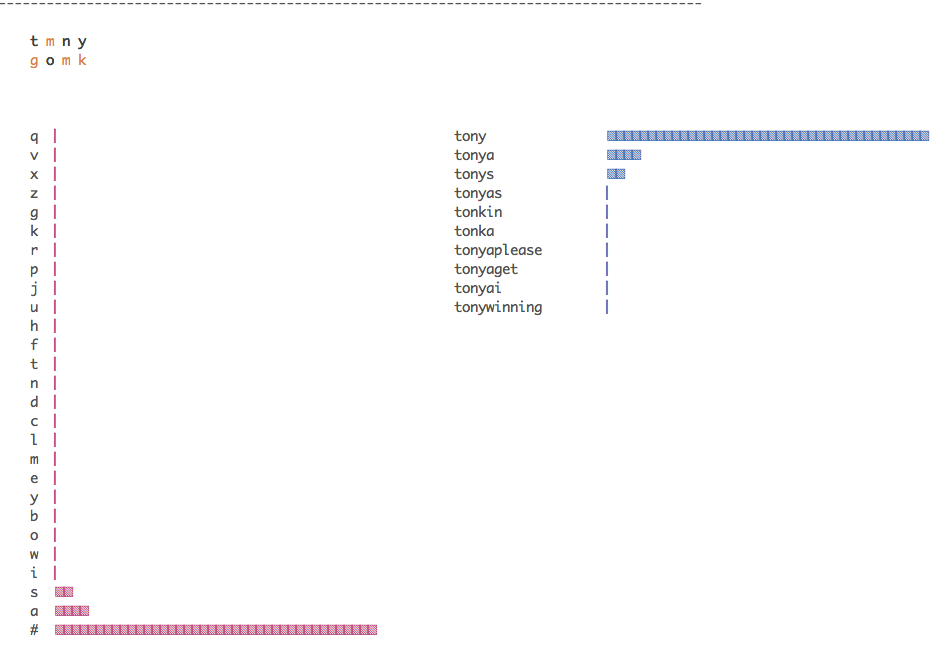

This repo describes algorithmically the Online Context Language Model (OCLM) model. The paper [A Multi-Context Character Prediction Model for a Brain-Computer Interface](http://aclweb.org/anthology/W18-1210) written by Dudy, Xu, Bedrick, and Smith provides further details to the priciples and motivation for this project in addition to a proof of concept.

```
@inproceedings{dudy-etal-2018-multi,
    title = "A Multi-Context Character Prediction Model for a Brain-Computer Interface",
    author = "Dudy, Shiran and Xu, Shaobin and Bedrick, Steven and Smith, David",
    booktitle = "Proceedings of the Second Workshop on Subword/Character {LE}vel Models",
    month = jun,
    year = "2018",
    address = "New Orleans",
    publisher = "Association for Computational Linguistics",
    url = "https://www.aclweb.org/anthology/W18-1210",
    doi = "10.18653/v1/W18-1210",
    pages = "72--77"
}
```

The code in the repo was mainly written by Dudy and Xu.

Additional requirements to run the code are:
  * [openfst](http://www.openfst.org/twiki/bin/view/FST/WebHome)
  * openfst for python (pip install openfst)
  * compiled [ebitweight](https://github.com/shiranD/ebitweight)
  * compiled [specilizer](https://github.com/shiranD/specializer)
  * optional: requests and json for python

This repo contains additional code for operational use and a demo code to show case OCLM performance.

Here are two screen shots taken from this demo:







Or Alternatively, you can ask for the docker image as everything is found there and ready for the either train+test or just test (with the current trained model)
